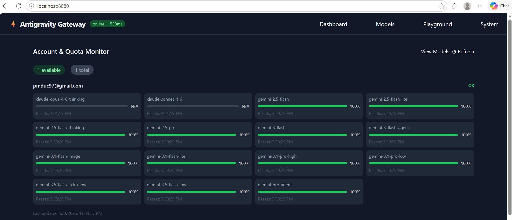

# Antigravity Gateway

[](https://opensource.org/licenses/MIT)

**Universal AI Gateway** - Access Claude and Gemini models through any OpenAI or Anthropic-compatible client, powered by Antigravity's Cloud Code.

```
┌─────────────────────────────────────────────────────────────────────────┐
│                         YOUR AI TOOLS                                   │
│  Cursor • Cline • Continue • Aider • Claude Code • Gemini CLI • etc.   │
└─────────────────────────────────────────────────────────────────────────┘
                                    │
                                    ▼
                    ┌───────────────────────────────┐
                    │     Antigravity Gateway       │
                    │  OpenAI + Anthropic API       │
                    └───────────────────────────────┘
                                    │
                                    ▼
                    ┌───────────────────────────────┐
                    │   Antigravity Cloud Code      │
                    │   Claude • Gemini models      │
                    └───────────────────────────────┘
```

## Features

- **Triple API Support**: OpenAI Chat Completions (`/v1/chat/completions`), OpenAI Responses (`/v1/responses`), and Anthropic (`/v1/messages`) endpoints
- **Multiple Models**: Access Claude Sonnet 4.5, Opus 4.5, and Gemini 3 Flash/Pro models
- **Extended Thinking**: Full support for reasoning/thinking models
- **Multi-Account Load Balancing**: Add multiple Google accounts for higher throughput
- **Universal Compatibility**: Works with any OpenAI or Anthropic-compatible client
- **Admin Web UI**: Built-in dashboard at `http://localhost:8080` — manage accounts, monitor quotas, test models, and chat directly from the browser

## Quick Start

```bash
git clone https://github.com/pmduc97/antigravity-gateway.git
cd antigravity-gateway
npm install
```

## Adding Google Accounts

The gateway requires Google accounts with Antigravity access. Add accounts via OAuth before starting the server:

```bash
# Interactive (opens browser)
node src/index.js accounts add

# Headless / no browser (manual code entry)
node src/index.js accounts add --no-browser

# List configured accounts
node src/index.js accounts list

# Verify account tokens
node src/index.js accounts verify
```

Once accounts are configured, start the server:

```bash
npm start

# With model fallback enabled
npm start -- --fallback

# With debug logging
npm start -- --debug
```

Once the server is running, open **`http://localhost:8080`** in your browser to access the Admin UI.

---

## Admin UI

The gateway includes a built-in web dashboard at `http://localhost:8080` with four tabs:



| Tab | Description |
|-----|-------------|
| **Dashboard** | View all accounts, quota usage (% remaining per model), and rate-limit countdowns |
| **Models** | Run a live health check against every available model — see which ones are working |
| **Playground** | Chat directly with any model from the browser to test speed and quality |
| **System** | View server health/latency and force-refresh OAuth tokens |

---

## Client Configuration

The gateway exposes three API endpoints:
- **OpenAI Chat Completions**: `http://localhost:8080/v1/chat/completions`
- **OpenAI Responses API**: `http://localhost:8080/v1/responses`
- **Anthropic-compatible**: `http://localhost:8080/v1/messages`

### API Endpoints

| Endpoint | Method | Description |
|----------|--------|-------------|
| `/v1/chat/completions` | POST | OpenAI Chat Completions API |
| `/v1/responses` | POST | OpenAI Responses API |
| `/v1/messages` | POST | Anthropic Messages API |
| `/v1/models` | GET | List available models |
| `/v1/real-models` | GET | Test and list working models |
| `/health` | GET | Health check |
| `/account-limits` | GET | Account quotas (add `?format=table`) |
| `/refresh-token` | POST | Force token refresh |

### Available Models

| Model ID | Type | Context | Output | Thinking |
|----------|------|---------|--------|----------|
| `claude-sonnet-4-5-thinking` | Claude | 200K | 16K | ✓ |
| `claude-opus-4-5-thinking` | Claude | 200K | 16K | ✓ |
| `claude-sonnet-4-5` | Claude | 200K | 8K | ✗ |
| `gemini-3-flash` | Gemini | 1M | 16K | ✓ |
| `gemini-3-pro-high` | Gemini | 1M | 16K | ✓ |
| `gemini-3-pro-low` | Gemini | 1M | 16K | ✓ |
| `gemini-3-pro-image` | Gemini | 1M | 16K | ✓ |
| `gemini-2.5-pro` | Gemini | 1M | 16K | ✓ |
| `gemini-2.5-flash` | Gemini | 1M | 16K | ✓ |
| `gemini-2.5-flash-thinking` | Gemini | 1M | 16K | ✓ |
| `gemini-2.5-flash-lite` | Gemini | 1M | 8K | ✗ |

> **Note**: Model availability depends on your Antigravity account. Run `curl http://localhost:8080/v1/models` to see your available models.

---

## AI Coding Tools Configuration

### OpenCode

Edit `~/.opencode/config.json`:
```json
{
  "provider": {
    "type": "openai",
    "baseUrl": "http://localhost:8080/v1",
    "apiKey": "any-value",
    "model": "gemini-3-flash"
  }
}
```

### Claude Code CLI

Create `~/.claude/settings.json`:
```json
{
  "env": {
    "ANTHROPIC_BASE_URL": "http://localhost:8080",
    "ANTHROPIC_API_KEY": "any-value"
  }
}
```

Then run: `claude`

### GitHub Copilot (VS Code)

Add a custom language model provider in VS Code settings (`settings.json`):
```json
{
  "lm.providers": [
    {
      "name": "GoogleAnti",
      "vendor": "customendpoint",
      "apiKey": "${input:chat.lm.secret.36f94449}",
      "apiType": "chat-completions",
      "models": [
        {
          "id": "gemini-2.5-flash-thinking",
          "name": "Gemini 2.5 Flash (Thinking)",
          "url": "http://localhost:8080/v1",
          "toolCalling": true,
          "vision": true,
          "maxInputTokens": 128000,
          "maxOutputTokens": 16000
        }
      ]
    }
  ]
}
```

---

## SDK Integration

### cURL

```bash
# OpenAI Chat Completions format
curl http://localhost:8080/v1/chat/completions \
  -H "Content-Type: application/json" \
  -H "Authorization: Bearer any-value" \
  -d '{
    "model": "gemini-3-flash",
    "messages": [{"role": "user", "content": "Hello!"}]
  }'

# OpenAI Responses API format
curl http://localhost:8080/v1/responses \
  -H "Content-Type: application/json" \
  -H "Authorization: Bearer any-value" \
  -d '{
    "model": "gemini-3-flash",
    "input": "Tell me a three sentence bedtime story about a unicorn."
  }'

# OpenAI Responses API with streaming
curl http://localhost:8080/v1/responses \
  -H "Content-Type: application/json" \
  -H "Authorization: Bearer any-value" \
  -d '{
    "model": "gemini-3-flash",
    "input": "Write a haiku about coding.",
    "stream": true
  }'

# Anthropic format
curl http://localhost:8080/v1/messages \
  -H "Content-Type: application/json" \
  -H "x-api-key: any-value" \
  -d '{
    "model": "claude-sonnet-4-5-thinking",
    "max_tokens": 1024,
    "messages": [{"role": "user", "content": "Hello!"}]
  }'
```

---

## Multi-Account Load Balancing

Add multiple Google accounts for higher throughput and automatic failover:

```bash
node src/index.js accounts add  # Add first account
node src/index.js accounts add  # Add second account
node src/index.js accounts add  # Add third account
```

The gateway automatically:
- Uses sticky account selection for prompt cache efficiency
- Switches accounts when rate limited
- Waits for short rate limits (≤2 min)
- Falls back to alternate models when all accounts exhausted

Check account status:
```bash
curl "http://localhost:8080/account-limits?format=table"
```

---

## Environment Variables

| Variable | Default | Description |
|----------|---------|-------------|
| `PORT` | `8080` | Server port |
| `DEBUG` | `false` | Enable debug logging |
| `FALLBACK` | `false` | Enable model fallback on quota exhaustion |

---

## Troubleshooting

### "No accounts available"

Add Google accounts: `node src/index.js accounts add`

### Rate limited

- Add more accounts for load balancing
- Enable fallback mode: `npm start -- --fallback`
- Wait for quota reset (shown in error message)

### Connection refused

Ensure the gateway is running: `npm start`

### Model not found

Use exact model IDs from `/v1/models` endpoint. Common models:
- `gemini-3-flash` (recommended for speed)
- `claude-sonnet-4-5-thinking` (recommended for quality)

---

## License

MIT License - see [LICENSE](LICENSE)

## Credits

Based on work from:
- [opencode-antigravity-auth](https://github.com/NoeFabris/opencode-antigravity-auth)
- [badri-s2001/antigravity-claude-proxy](https://github.com/badri-s2001/antigravity-claude-proxy)
